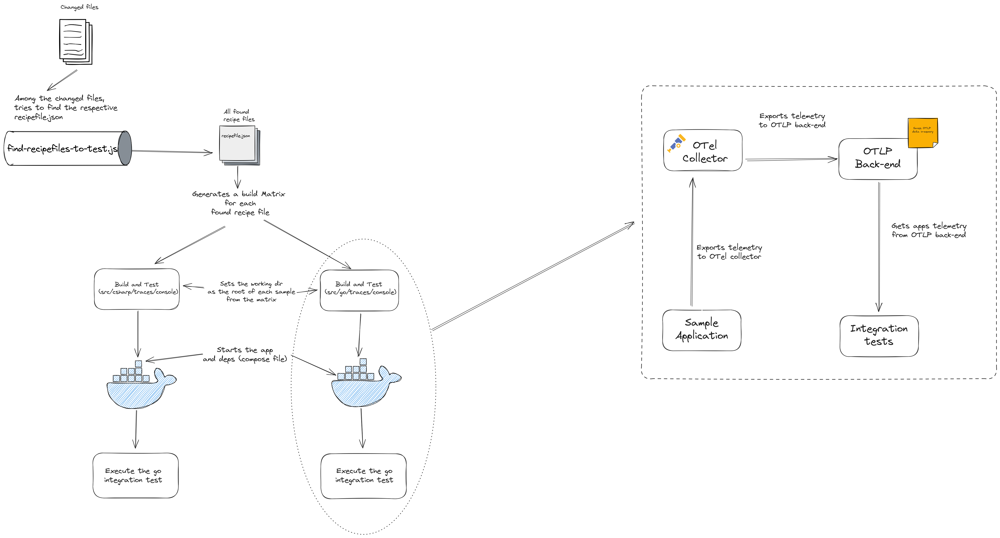

# Architecture

The idea behind OTel recipes is: Wouldn't it be nice if there was a list of steps that I could follow
and, in the end, I "have OTel in my app"?

This is what guides the entire architecture and design decisions of the project. In its core, OTel recipes MUST

- Be easy and approachable for newcomers in OpenTelemetry
- Teach people "how do I do X" with OpenTelemetry
- Be certain that if the steps are followed **it will work**. There's nothing more
  frustrating than copying and pasting some snippets only to realize they don't work.

With this premise, let's dive deep into the components that comprise OTel recipes.

## Recipe file (`recipefile.json`)

At the core, there's the [recipe file JSON schema](./otel-recipes-schema.json). The `recipefile.json`
can be understood as the metadata about each recipe application. The recipe file explains what the sample
application is about, which telemetry signal (traces, metrics, logs) it is teaching users, and, more importantly,
which steps the user must do to achieve the goal.

The idea behind the `steps` property in the recipe file is to show exactly what/where users need to change
in their applications. For example, if the goal is: *Configure my application to emit OTel traces*, a list
of steps would be:

1. Install the dependencies
2. Configure the OTel SDK for traces
3. Record a span with an attribute

Each step then **links** to the actual code file of the recipe in
the repository via the `source` property. This property is the most important and it is what is used to
rendered the code step in the website!

The recipe files are also checked via GitHub workflows against the JSON schema. So, if something is wrong
it will be caught during CI checks 😉. (See [Check recipe file workflow](./.github/workflows/recipefile-schema-check.yml)).

## Sample applications

The sample applications are the bulk of content in the project. To help searching/filtering, the samples are
categorized in programming language and telemetry signal.

```shell
src/
└── csharp/
    └── traces/
    └── metrics/
    └── logs/
```

Along with its `recipefile.json`, each application MUST declare its `Dockerfile`,
a Go test module and a `docker-compose.yaml`. During CI, the application is started
and its declaring integration test is executed.

This all happens in the workflow [Build and Test](./.github/workflows/recipe-samples-tests.yml):



Thanks to the file conventions, the GitHub workflow becomes simple and generic: At the same hierarchy
a `recipefile.json` is found, we can also assume there's a `docker-compose.yml` file
that knows how to start everything it is needed to run and test the sample application.

Another benefit of the structure above is: each sample application can define and use its own dependencies
without "poluting" the rest of samples. For example, if a sample wants to demonstrate how to
instrument async scenarios, e.g., via messaging systems, it can add the messasing system as a dependency
in the compose file. Nothing else needs to change 😎.
## Tests

To learn how to use the test framework/utilities, see [Test utils](./internal/common/testutils/README.md).

What is left for the actual integration test is:

- Fetch the app's telemetry
- Run assertions

That is when the goal of keeping the use-cases for the sample apps simple and minimal comes in handy.
With the test utils, we can query the OTLP back-end and "find" the spans/metrics/logs we are looking for.

To learn how to add a a integration test for a recipe application, see [Testing a recipe](./CONTRIBUTING.md#testing-a-recipe)

## Website

To tied things together we have the website - a single page application built with [Sveltekit](https://kit.svelte.dev/).

The website runs completely on the client side. There's no back-end service the website's communicate
with to get the recipes data. So how does it work, you ask?

The website uses the `recipefile.json` files from all the apps!. During a release,
all the `recipefile.json` are bundled together (using `jq`) into a single `.json` file which is then
minified and embedded in the website.

For starting, this approach will be probably enough, apart from making the website super snappy 🚀
as there's nothing to be loaded.

Then the website simply rely on the `recipefile.json` structure to display all the information
about the recipe application, specially the individual steps on how to get it configured with OpenTelemetry.
